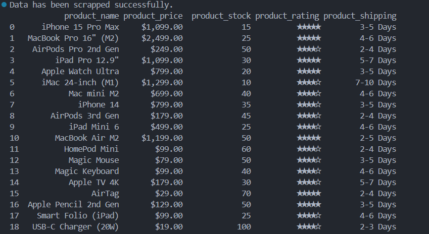

# Scraping Data from HTML Webpage

<p align="justify">
This project demonstrates how to <b>scrape product data</b> from a fictitious e-commerce store webpage built using HTML.
</p>

<p align="justify">
The scraping script leverages <code>BeautifulSoup</code>, <code>CSV</code>, and <code>Pandas</code> to extract product details, store them in a structured dataset, and perform basic validation by reading the output into a DataFrame.
</p>

## Objectives
- Extract product information (name, price, stock, rating, shipping) from the HTML file.
- Save the scraped data into a **CSV dataset**.
- Validate the dataset by loading it into a **Pandas DataFrame**.

## Operations & Tasks

<p>
1. Import required Python libraries for scraping and data handling.
</p>

```python
from bs4 import BeautifulSoup
import csv
import pandas as pd
```

<p>
2. Load the HTML file and parse it into a BeautifulSoup object.
</p>

```python
with open(html_path, 'r', encoding='utf-8') as html_file:
    html_content = html_file.read()

soup = BeautifulSoup(html_content, 'html.parser')
```

<p>
3. Loop through product elements and extract relevant attributes.
</p>

```python
products = soup.find_all('div', attrs={'class': 'product'})

for prod in products:
    product_name = prod.find('h3').text
    product_details = prod.find_all('p')
    product_price = product_details[0].text.replace('Price: ', '')
    product_stock = product_details[1].text.replace('Quantity Available: ', '')
    product_rating = prod.find('p', attrs={'class': 'rating'}).text
    product_shipping = product_details[-1].text.replace('Estimated Shipping: ', '')
```

<p>
4. Save extracted product data into a structured CSV file.
</p>

```python
with open('apple_scrapped_data.csv', 'w', encoding='utf-8') as file_csv:
    writer = csv.writer(file_csv)
    writer.writerow(['product_name','product_price','product_stock','product_rating','product_shipping'])
    # Loop through products and write rows
```

<p>
5. Read the CSV file into a Pandas DataFrame and print results.
</p>

```python
file_csv_read = pd.read_csv('apple_scrapped_data.csv', encoding='utf-8')
file_df = pd.DataFrame(file_csv_read)
print(file_df)
```
